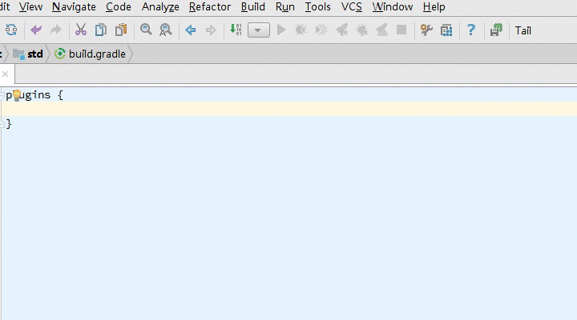
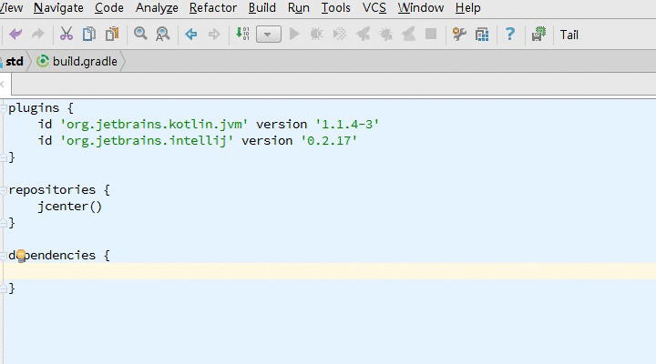
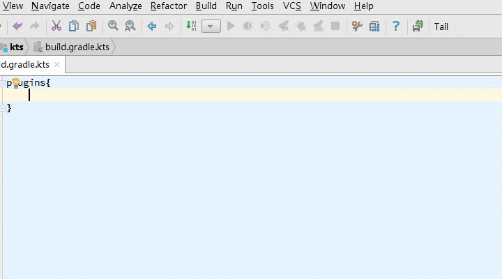
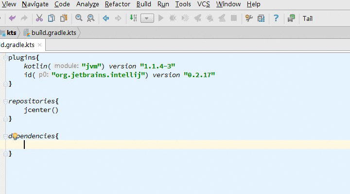
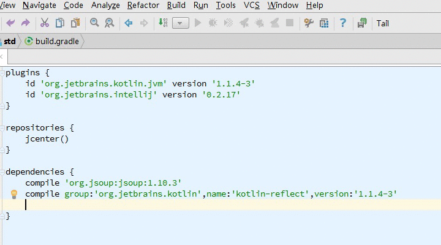
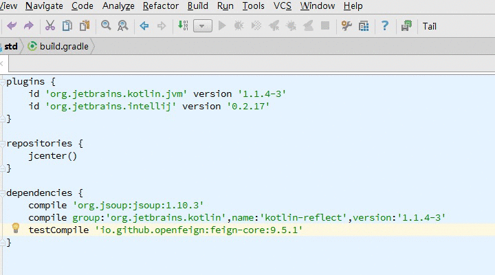
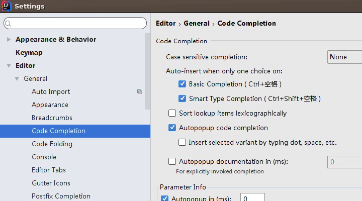
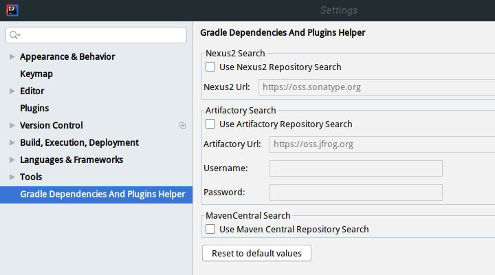

# GradleDependenciesAndPluginsHelper

Gradle plugins/dependencies 坐标自动补全IntelliJ IDEA插件 [插件地址](https://plugins.jetbrains.com/plugin/10033-gradle-dependencies-and-plugins-helper)

### 功能

* 使用IntelliJ IDEA Smart Type Completion功能自动补全Gradle脚本中dependencies及plugins的依赖库坐标

* 支持Gradle groovy脚本（*.build）及kotlin脚本（*.build.kts）

* 默认使用[jcenter API](https://bintray.comdocs/api/)搜索dependencies，使用[Gradle Plugins](https://plugins.gradle.org)搜索plugins

* 支持通配符*

* 支持通过类名搜索依赖库坐标
    
    在dependencies区域使用 "c:"(classname) 或 "fc:"( fully-qualified classname )搜索依赖库坐标
    
    例子：
    
        compile("fc:org.junit.Test")
    
        compile("c:Junit")

* 可选添加特定maven仓库到repositories.Use `Show Intention Actions` action (`Alt + Enter` or ⌥⏎) and choose `Add specified repository to repositories.`

### 设置

* 使用前确定Smart Type Completion功能开启

* 可选使用 `Use AliRepo Search`,`Use Maven Central Repository Search`,`Use Nexus2 Repository Search`(Nexus2),`Use Artifactory Repository Search` 搜索

